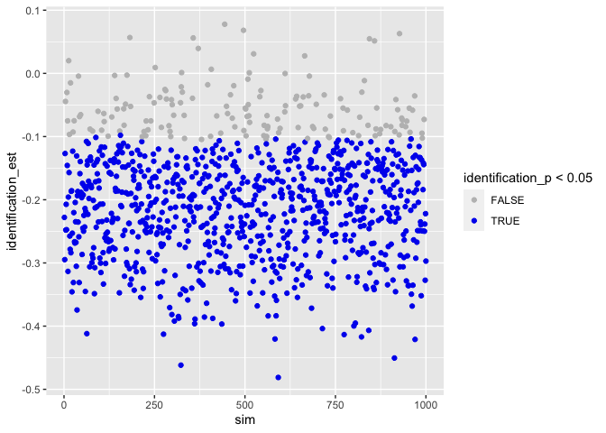
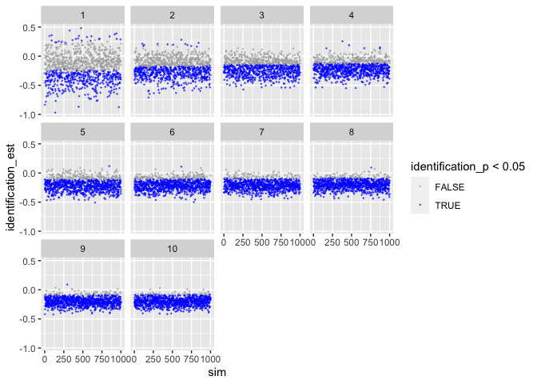
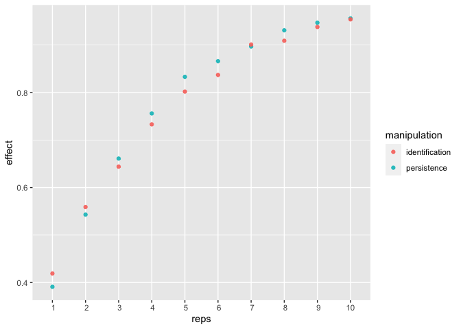
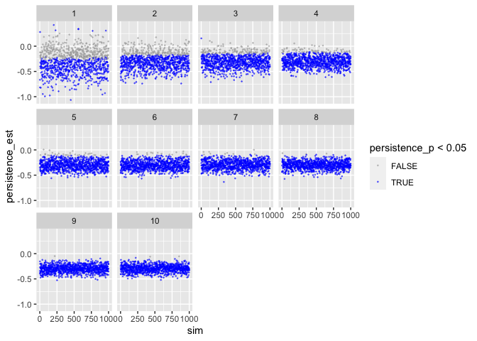
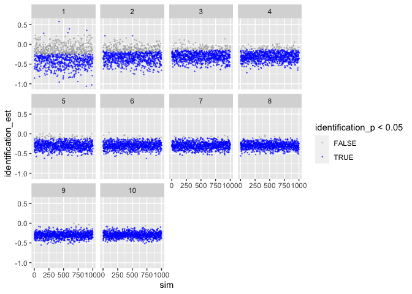
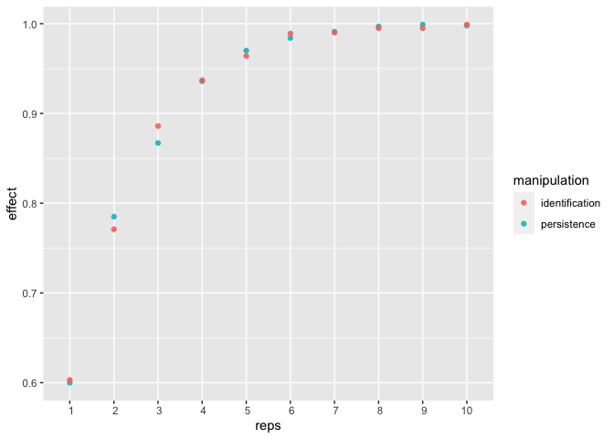

Power Analysis
================
Tobias Dienlin

-   [Background](#background)
-   [Custom functions](#custom-functions)
-   [Study Design](#study-design)
-   [Define effect size](#define-effect-size)
-   [Test run](#test-run)
    -   [Set-up](#set-up)
    -   [Simulate data](#simulate-data)
    -   [Analyse data](#analyse-data)
-   [Power analysis 1](#power-analysis-1)
    -   [Visualization](#visualization)
    -   [Cell means & main effects](#cell-means--main-effects)
    -   [Power Estimates](#power-estimates)
-   [Power analysis 2](#power-analysis-2)
    -   [Visualization](#visualization-1)
    -   [Cell means & main effects](#cell-means--main-effects-1)
    -   [Power Estimates](#power-estimates-1)
-   [Next steps](#next-steps)

``` r
library(broom)
library(ggplot2)
library(magrittr)
library(tidyverse)
```

# Background

Here, we run some power analysis for a study on online political
participation. In the study, people use a social networking site
(discord) on which they discuss political matters. Participants will
communicate in groups of 20 people each (medium scale group
communication). The dependent variable is how much people discuss
(measured via *number of words*). We’re interested how different SNS
designs affect communication.

The study design is as follows:

-   The website is experimentally manipulated (2 x 2 design).
-   First, the *persistence* of the comments is manipulated (permanent
    vs. ephemeral), as well as *identification* (identifiable
    vs. anonymous).
-   To increase generalizability, the groups will discuss one of three
    *topics*: corona politics, environment, gender.

So these are 2 (identification) x 2 (persistence) experimental factors
and a 3-way generalization factor (topic), resulting in a minimum of 12
groups. Hence, the minimum sample size 12 x 20 = 240 participants.

To calculate power, the question now is how often do we need to *repeat*
this design to achieve sufficient power? Once, twice, thrice, etc?
Hence, the factor to change/affect power is *repetition*, ranging from 1
to 10.

# Custom functions

``` r
generate_design <- function(groupsize, 
                            persis, 
                            ident, 
                            topics, 
                            repetition, 
                            ...){
  
  # function generates underlying (empty) datastructure
  
  # count number of groups
  groups <- persis * ident * topics * repetition
  
  # make datastructure
  expand.grid(
    participant = 1:groupsize, 
    persistence = 1:persis - 1, # -1 to make binary
    identification = 1:ident - 1, 
    topic = 1:topics,
    repetition = 1:repetition) %>% 
    as.data.frame() %>% 
    rownames_to_column("id") %>% 
    mutate(
      group = rep(c(1:groups), each = groupsize))
}

sim_d <- function(d_frame, 
                  seed, # make results reproducible
                  effects, # vector of effects we anticipate
                  sd, 
                  groupsize, 
                  ...){
  
  # function to simulate data

  # set.seed(seed)  # uncomment to make results reproducible
  
  # compute how many participants per cell (exp. condition)
  n_cell <- groupsize_n * topics_n * repetition_n
  
  # create the DV. 
  # For now, this will be standardized, bc. of lack of concrete data

  # version 1: if-else # produces weird results
  # d_frame %<>%
  #   mutate(words = 
  #     ifelse(persistence == 0 & identification == 0, rnorm(n_cell, effects["pers0_iden_0_m"], sd),
  #        ifelse(persistence == 0 & identification == 1, rnorm(n_cell, effects["pers0_iden_1_m"], sd),
  #            ifelse(persistence == 1 & identification == 0, rnorm(n_cell, effects["pers1_iden_0_m"], sd),
  #                rnorm(n_cell, effects["pers1_iden_1_m"], sd))))
  #          )
  
  # version 2: filter
  d_frame$words <- 999
  for(i in 1 : repetition_n) {
    d_frame[d_frame$persistence == 0 & d_frame$identification == 0 & d_frame$repetition == i, ]$words <- 
      rnorm(groupsize_n, effects["pers0_iden_0_m"], sd)
    d_frame[d_frame$persistence == 0 & d_frame$identification == 1 & d_frame$repetition == i, ]$words <- 
      rnorm(groupsize_n, effects["pers0_iden_1_m"], sd)
    d_frame[d_frame$persistence == 1 & d_frame$identification == 0 & d_frame$repetition == i, ]$words <- 
      rnorm(groupsize_n, effects["pers1_iden_0_m"], sd)
    d_frame[d_frame$persistence == 1 & d_frame$identification == 1 & d_frame$repetition == i, ]$words <- 
      rnorm(groupsize_n, effects["pers1_iden_1_m"], sd)
  }
    
  return(d_frame)
}

analyze_d <- function(object, ...) {

  # function to analyze data and to extract results
  
  # get means
  means <- group_by(object, persistence, identification) %>% 
    summarize(mean = mean(words), .groups = 'drop')
  
  # get estimates from regression
  fit <- lm(words ~ persistence + identification, object)
  fit_res <- tidy(fit)
  
  # combine result
  results <- data.frame(
    reps = repetition_n,
    per0_ide0_m = filter(means, persistence == 0, identification == 0)$mean,
    per0_ide1_m = filter(means, persistence == 0, identification == 1)$mean,
    per1_ide0_m = filter(means, persistence == 1, identification == 0)$mean,
    per1_ide1_m = filter(means, persistence == 1, identification == 1)$mean,
    persistence_est = fit_res[fit_res$term == "persistence",]$estimate,
    persistence_p = fit_res[fit_res$term == "persistence",]$p.value,
    identification_est = fit_res[fit_res$term == "identification",]$estimate,
    identification_p = fit_res[fit_res$term == "identification",]$p.value,
    n = glance(fit)$nobs
  ) 
  return(results)
}

des_sim_fit <- function(...){
  
  # function to report and extract results
  
  d_frame <- generate_design(...)
  d <- sim_d(d_frame, ...)
  analyze_d(d)
}

est_pow <- function(n_sim = 1000, ...){
  # function to run analyse n_sim times

  tibble(sim = 1:n_sim) %>% 
  mutate(
    effect = map(sim, 
                 des_sim_fit, 
                 groupsize = groupsize_n, 
                 persis = persis_n, 
                 ident = ident_n, 
                 topics = topics_n, 
                 repetition = repetition_n, 
                 effects = effects_est, 
                 sd = sd_est)
    ) %>%
  unnest(effect) %>%
  as.data.frame()
}
```

# Study Design

``` r
# study design
groupsize_n   <- 20
persis_n      <- 2
ident_n       <- 2 
topics_n      <- 3

# minimum sample size
sample_size <- groupsize_n * persis_n * ident_n * topics_n
```

We define our study design as follows:

-   20 participants per group
-   2 persistence conditions
-   2 identification conditions
-   3 different topics to be discussed
-   240 minimum sample size

# Define effect size

We then need to define likely effects. Problem is, we don’t have good
estimates of actual, raw date. To simplify, we assume normal
distribution, a mean of zero and a standard deviation of one. We can
hence think of effects in terms of Cohen’s d: .2 = small, .5 = medium,
and .8 = large.

|              | persistent | ephemeral |
|--------------|:----------:|:---------:|
| identifiable |    -.40    |   -.20    |
| anonymous    |    -.20    |     0     |

This should lead to a main effect of persistence of d = -.20 and a main
effect of identifiability of d = -.20.

``` r
pers0_iden_0_m <- 0
pers0_iden_1_m <- -.2
pers1_iden_0_m <- -.2
pers1_iden_1_m <- -.4
effects_est <- c(pers0_iden_0_m, pers0_iden_1_m, pers1_iden_0_m, pers1_iden_1_m)
names(effects_est) <- c("pers0_iden_0_m", "pers0_iden_1_m", "pers1_iden_0_m", "pers1_iden_1_m")
sd_est <- 1
```

# Test run

To see if our functions work, let’s make a test run with only one
repetition.

``` r
repetition_n <- 1
```

## Set-up

We first create an empty data frame, in which we will then later
simulate the data.

``` r
# create design frame
d_frame <- generate_design(
  groupsize  = groupsize_n,
  persis     = persis_n,  
  ident      = ident_n,     
  topics     = topics_n,  
  repetition = repetition_n
  )
d_frame
```

Check if data-frame is alright.

``` r
xtabs(~persistence + identification + topic + repetition, d_frame)
```

Allocation of participants to experimental groups worked just fine.

## Simulate data

Let’s create a single data-set and analyze it.

``` r
d <- sim_d(d_frame, seed = 1, effects_est, sd_est, groupsize_n)
```

## Analyse data

Let’s check if means were created alright:

``` r
means <- d %>% 
  group_by(persistence, identification) %>% 
  summarize(mean = mean(words), .groups = 'drop')
means
```

    ## # A tibble: 4 × 3
    ##   persistence identification    mean
    ##         <dbl>          <dbl>   <dbl>
    ## 1           0              0  0.191 
    ## 2           0              1 -0.206 
    ## 3           1              0 -0.0612
    ## 4           1              1 -0.298

Sample size small and single study, but general tendency seems to be
alright.

Let’s also quickly run a regression.

``` r
lm(words ~ persistence + identification, d) %>% 
  summary()
```

    ## 
    ## Call:
    ## lm(formula = words ~ persistence + identification, data = d)
    ## 
    ## Residuals:
    ##      Min       1Q   Median       3Q      Max 
    ## -2.36524 -0.52025  0.02285  0.55831  2.33986 
    ## 
    ## Coefficients:
    ##                Estimate Std. Error t value Pr(>|t|)   
    ## (Intercept)      0.1505     0.1005   1.498  0.13543   
    ## persistence     -0.1718     0.1160  -1.480  0.14013   
    ## identification  -0.3170     0.1160  -2.732  0.00676 **
    ## ---
    ## Signif. codes:  0 '***' 0.001 '**' 0.01 '*' 0.05 '.' 0.1 ' ' 1
    ## 
    ## Residual standard error: 0.8988 on 237 degrees of freedom
    ## Multiple R-squared:  0.03915,    Adjusted R-squared:  0.03104 
    ## F-statistic: 4.828 on 2 and 237 DF,  p-value: 0.008805

Results look reasonable. Both persistence and identification reduce
disclosure.

# Power analysis 1

Let’s next run our actual power analysis, using the effect sizes defined
above (small standardized effects).

``` r
n_sim <- 1000
n_reps <- 10
```

We run a power analysis with 1000 simulations per design. We test 10
designs, that is 1 to 10 repetitions.

``` r
# create empy data frame
columns <- c("sim", "reps", "per0_ide0_m", "per0_ide1_m", 
             "per1_ide0_m", "per1_ide1_m", "persistence_est", 
             "persistence_p", "identification_est", "identification_p", "n")
sims <- data.frame(matrix(nrow = 0, ncol = length(columns))) 
colnames(sims) = columns

for(i in 1 : n_reps){
  repetition_n  <- i
  sims <- rbind(sims, est_pow())
}
```

## Visualization

Let’s inspect the results. First persistence:

``` r
ggplot(sims) +
  geom_point(aes(sim, persistence_est, color = persistence_p < .05), 
             size = .2, alpha = .5) + 
  scale_color_manual(values = c("darkgrey", "blue")) +
  facet_wrap(facets = "reps")
```

<!-- -->

Shows that with more repetitions, effect size move closer to actual
population value.

To make sure, let’s next check identification – should provide identical
results.

``` r
ggplot(sims) +
  geom_point(aes(sim, identification_est, color = identification_p < .05), 
             size = .2, alpha = .5) + 
  scale_color_manual(values = c("darkgrey", "blue")) +
  facet_wrap(facets = "reps")
```

<!-- -->

Looks good.

## Cell means & main effects

Next, we compute the average means in the four cells averaged across
simulations, plus the two main effects. This is more of a sanity check
to see if our population values can be reproduced.

``` r
sims %>% 
  group_by(reps) %>% 
  summarise(per0_ide0 = mean(per0_ide0_m),
            per0_ide1 = mean(per0_ide1_m),
            per1_ide0 = mean(per1_ide0_m),
            per1_ide1 = mean(per1_ide1_m),
            persistence = mean(persistence_est), 
            identification = mean(identification_est)
            )
```

    ## # A tibble: 10 × 7
    ##     reps  per0_ide0 per0_ide1 per1_ide0 per1_ide1 persistence identification
    ##    <int>      <dbl>     <dbl>     <dbl>     <dbl>       <dbl>          <dbl>
    ##  1     1 -0.00326      -0.205    -0.200    -0.401      -0.196         -0.202
    ##  2     2 -0.00340      -0.198    -0.200    -0.398      -0.198         -0.197
    ##  3     3 -0.000849     -0.199    -0.204    -0.397      -0.201         -0.196
    ##  4     4 -0.0000881    -0.198    -0.204    -0.402      -0.204         -0.198
    ##  5     5  0.00397      -0.192    -0.200    -0.402      -0.207         -0.199
    ##  6     6 -0.00370      -0.201    -0.200    -0.404      -0.199         -0.201
    ##  7     7  0.00707      -0.200    -0.199    -0.403      -0.204         -0.205
    ##  8     8  0.00232      -0.200    -0.206    -0.400      -0.205         -0.198
    ##  9     9  0.00387      -0.198    -0.202    -0.401      -0.204         -0.201
    ## 10    10 -0.000569     -0.198    -0.198    -0.403      -0.201         -0.202

Shows that the means resemble those we defined a priori. Same for main
effects.

## Power Estimates

Now, let’s compute power for each number of replication.

``` r
power <- sims %>% 
  group_by(reps) %>% 
  summarise(persistence = sum(persistence_p < .05 & persistence_est < 0) / n_sim,
            identification = sum(identification_p < .05 & identification_est < 0) / n_sim,
            n = max(n))
print(power)
```

    ## # A tibble: 10 × 4
    ##     reps persistence identification     n
    ##    <int>       <dbl>          <dbl> <int>
    ##  1     1       0.391          0.419   240
    ##  2     2       0.543          0.559   480
    ##  3     3       0.661          0.644   720
    ##  4     4       0.756          0.733   960
    ##  5     5       0.833          0.802  1200
    ##  6     6       0.866          0.837  1440
    ##  7     7       0.897          0.901  1680
    ##  8     8       0.931          0.909  1920
    ##  9     9       0.947          0.938  2160
    ## 10    10       0.956          0.954  2400

``` r
dat <- power %>% pivot_longer(c(-reps, -n), names_to = "manipulation", values_to = "effect")
power_fig <- ggplot(dat, aes(reps, effect, color = manipulation)) +
  geom_point(alpha = .9) +
  scale_x_discrete(limits = c(1:10))
```

    ## Warning: Continuous limits supplied to discrete scale.
    ## Did you mean `limits = factor(...)` or `scale_*_continuous()`?

``` r
power_fig
```

<!-- -->

If we replicate the study at least 5 times, then we get more than 80%
power.

# Power analysis 2

Let’s next run our power analysis, using slightly larger effect sized
(small to medium).

``` r
pers0_iden_0_m <- 0
pers0_iden_1_m <- -.3
pers1_iden_0_m <- -.3
pers1_iden_1_m <- -.6
effects_est <- c(pers0_iden_0_m, pers0_iden_1_m, pers1_iden_0_m, pers1_iden_1_m)
names(effects_est) <- c("pers0_iden_0_m", "pers0_iden_1_m", "pers1_iden_0_m", "pers1_iden_1_m")
sd_est <- 1
```

We run a power analysis with 1000 simulations per design. We test 10
designs, that is 1 to 10 repetitions.

``` r
# create empy data frame
columns <- c("sim", "reps", "per0_ide0_m", "per0_ide1_m", 
             "per1_ide0_m", "per1_ide1_m", "persistence_est", 
             "persistence_p", "identification_est", "identification_p", "n")
sims <- data.frame(matrix(nrow = 0, ncol = length(columns))) 
colnames(sims) = columns

for(i in 1 : n_reps){
  repetition_n  <- i
  sims <- rbind(sims, est_pow())
}
```

## Visualization

Let’s inspect the results. First persistence:

``` r
ggplot(sims) +
  geom_point(aes(sim, persistence_est, color = persistence_p < .05), 
             size = .2, alpha = .5) + 
  scale_color_manual(values = c("darkgrey", "blue")) +
  facet_wrap(facets = "reps")
```

<!-- -->

Shows that with more repetitions, effect size move closer to actual
population value.

To make sure, let’s next check identification – should provide identical
results.

``` r
ggplot(sims) +
  geom_point(aes(sim, identification_est, color = identification_p < .05), 
             size = .2, alpha = .5) + 
  scale_color_manual(values = c("darkgrey", "blue")) +
  facet_wrap(facets = "reps")
```

<!-- -->

Looks good.

## Cell means & main effects

Next, we compute the average means in the four cells averaged across
simulations, plus the two main effects. This is more of a sanity check
to see if our population values can be reproduced.

``` r
sims %>% 
  group_by(reps) %>% 
  summarise(per0_ide0 = mean(per0_ide0_m),
            per0_ide1 = mean(per0_ide1_m),
            per1_ide0 = mean(per1_ide0_m),
            per1_ide1 = mean(per1_ide1_m),
            persistence = mean(persistence_est), 
            identification = mean(identification_est)
            )
```

    ## # A tibble: 10 × 7
    ##     reps  per0_ide0 per0_ide1 per1_ide0 per1_ide1 persistence identification
    ##    <int>      <dbl>     <dbl>     <dbl>     <dbl>       <dbl>          <dbl>
    ##  1     1  0.00595      -0.298    -0.304    -0.614      -0.313         -0.307
    ##  2     2 -0.00199      -0.293    -0.297    -0.597      -0.300         -0.296
    ##  3     3 -0.00497      -0.295    -0.302    -0.595      -0.298         -0.292
    ##  4     4  0.00251      -0.302    -0.298    -0.602      -0.300         -0.304
    ##  5     5 -0.00327      -0.299    -0.301    -0.598      -0.298         -0.296
    ##  6     6  0.00225      -0.298    -0.300    -0.601      -0.303         -0.300
    ##  7     7 -0.000581     -0.302    -0.297    -0.599      -0.297         -0.302
    ##  8     8 -0.000324     -0.295    -0.296    -0.599      -0.300         -0.299
    ##  9     9  0.0000172    -0.297    -0.296    -0.601      -0.300         -0.301
    ## 10    10 -0.00280      -0.305    -0.304    -0.595      -0.296         -0.296

Shows that the means resemble those we defined a priori. Same for main
effects.

## Power Estimates

Now, let’s compute power for each number of replication.

``` r
power <- sims %>% 
  group_by(reps) %>% 
  summarise(persistence = sum(persistence_p < .05 & persistence_est < 0) / n_sim,
            identification = sum(identification_p < .05 & identification_est < 0) / n_sim,
            n = max(n))
print(power)
```

    ## # A tibble: 10 × 4
    ##     reps persistence identification     n
    ##    <int>       <dbl>          <dbl> <int>
    ##  1     1       0.6            0.603   240
    ##  2     2       0.785          0.771   480
    ##  3     3       0.867          0.886   720
    ##  4     4       0.936          0.937   960
    ##  5     5       0.97           0.964  1200
    ##  6     6       0.984          0.989  1440
    ##  7     7       0.991          0.99   1680
    ##  8     8       0.997          0.995  1920
    ##  9     9       0.999          0.995  2160
    ## 10    10       0.998          0.999  2400

If we replicate the study at least 3 times, then we get more than 80%
power.

``` r
dat <- power %>% pivot_longer(c(-reps, -n), names_to = "manipulation", values_to = "effect")
power_fig <- ggplot(dat, aes(reps, effect, color = manipulation)) +
  geom_point(alpha = .9) +
  scale_x_discrete(limits = c(1:10))
```

    ## Warning: Continuous limits supplied to discrete scale.
    ## Did you mean `limits = factor(...)` or `scale_*_continuous()`?

``` r
power_fig
```

<!-- -->

# Next steps

-   Run power analysis for Bayes Factors comparing different hypotheses
-   Simulate new data with unstandardized results
-   Simulate new data with more realistic distribution; i.e.,
    zero-inflated beta/gamma distribution.
-   Analyze data using mixed effects model
-   Simulate data with hierarchical structure
