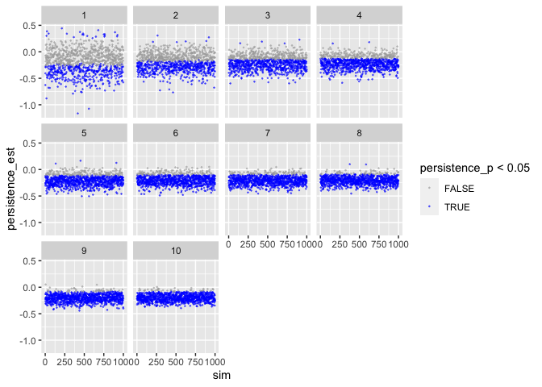

Power Analysis
================
Tobias Dienlin

-   [Background](#background)
-   [Custom functions](#custom-functions)
-   [Define study design and sample
    size](#define-study-design-and-sample-size)
-   [Create data frame](#create-data-frame)
-   [Define effect size](#define-effect-size)
-   [Test run](#test-run)
-   [Power analysis](#power-analysis)

``` r
library(broom)
library(ggplot2)
library(magrittr)
library(tidyverse)
```

# Background

Here, I run some power analysis for a study on online political
participation. In the study, people use a social networking site
(discord) on which they discuss political matters. Participants will
communicate in groups of 20 people each (medium scale group
communication). The dependent variable is how much people discuss
(measured via *number of words*). We’re interested how different SNS
designs affect communication.

The study design is as follows:

-   The website is experimentally manipulated (2 x 2 design).
-   First, the *persistence* of the comments is manipulated (permanent
    vs. ephemeral), as well as *identification* (identifiable
    vs. anonymous).
-   To increase generalizability, the groups will discuss one of three
    *topics*: corona politics, environment, gender.

So these are 2 (identification) x 2 (persistence) experimental factors
and a 3-way generalization factor (topic), resulting in a minimum of 12
groups. Hence, the minimum sample size 12 x 20 = 240 participants.

To calculate power, the question now is how often do we need to *repeat*
this design to achieve sufficient power? Once, twice, thrice, etc?
Hence, the factor to change/affect power is *repetition*, ranging from 1
to 10.

# Custom functions

``` r
generate_design <- function(groupsize, 
                            persis, 
                            ident, 
                            topics, 
                            repetition, 
                            ...){
  
  # function generates underlying (empty) datastructure
  
  # count number of groups
  groups <- persis * ident * topics * repetition
  
  # make datastructure
  expand.grid(
    participant = 1:groupsize, 
    persistence = 1:persis - 1, # -1 to make binary
    identification = 1:ident - 1, 
    topic = 1:topics,
    repetition = 1:repetition) %>% 
    as.data.frame() %>% 
    rownames_to_column("id") %>% 
    mutate(
      group = rep(c(1:groups), each = groupsize))
}

sim_d <- function(d_frame, 
                  seed, # make results reproducible
                  effects, # vector of effects we anticipate
                  sd, 
                  groupsize, 
                  ...){
  
  # function to simulate data

  # set.seed(seed)  # uncomment to make results reproducible
  
  # compute how many participants per cell (exp. condition)
  n_cell <- groupsize_n * topics_n * repetition_n
  
  # create the DV. 
  # For now, this will be standardized, bc. of lack of concrete data

  # version 1: if-else # produces weird results
  # d_frame %<>%
  #   mutate(words = 
  #     ifelse(persistence == 0 & identification == 0, rnorm(n_cell, effects["pers0_iden_0_m"], sd),
  #        ifelse(persistence == 0 & identification == 1, rnorm(n_cell, effects["pers0_iden_1_m"], sd),
  #            ifelse(persistence == 1 & identification == 0, rnorm(n_cell, effects["pers1_iden_0_m"], sd),
  #                rnorm(n_cell, effects["pers1_iden_1_m"], sd))))
  #          )
  
  # version 2: filter
  d_frame$words <- 999
  for(i in 1 : repetition_n) {
    d_frame[d_frame$persistence == 0 & d_frame$identification == 0 & d_frame$repetition == i, ]$words <- 
      rnorm(groupsize_n, effects["pers0_iden_0_m"], sd)
    d_frame[d_frame$persistence == 0 & d_frame$identification == 1 & d_frame$repetition == i, ]$words <- 
      rnorm(groupsize_n, effects["pers0_iden_1_m"], sd)
    d_frame[d_frame$persistence == 1 & d_frame$identification == 0 & d_frame$repetition == i, ]$words <- 
      rnorm(groupsize_n, effects["pers1_iden_0_m"], sd)
    d_frame[d_frame$persistence == 1 & d_frame$identification == 1 & d_frame$repetition == i, ]$words <- 
      rnorm(groupsize_n, effects["pers1_iden_1_m"], sd)
  }
    
  return(d_frame)
}

analyze_d <- function(object, ...) {

  # function to analyze data and to extract results
  
  # get means
  means <- group_by(object, persistence, identification) %>% 
    summarize(mean = mean(words), .groups = 'drop')
  
  # get estimates from regression
  fit <- lm(words ~ persistence + identification, object)
  fit_res <- tidy(fit)
  
  # combine result
  results <- data.frame(
    per0_ide0_m = filter(means, persistence == 0, identification == 0)$mean,
    per0_ide1_m = filter(means, persistence == 0, identification == 1)$mean,
    per1_ide0_m = filter(means, persistence == 1, identification == 0)$mean,
    per1_ide1_m = filter(means, persistence == 1, identification == 1)$mean,
    persistence_est = fit_res[fit_res$term == "persistence",]$estimate,
    persistence_p = fit_res[fit_res$term == "persistence",]$p.value,
    identification_est = fit_res[fit_res$term == "identification",]$estimate,
    identification_p = fit_res[fit_res$term == "identification",]$p.value,
    n = glance(fit)$nobs
  ) 
  return(results)
}

des_sim_fit <- function(...){
  
  # function to report and extract results
  
  d_frame <- generate_design(...)
  # words <- sim_d(d_frame, ...)
  # d <- cbind(d_frame, words)
  d <- sim_d(d_frame, ...)
  analyze_d(d)
}
```

# Define study design and sample size

``` r
# study design
groupsize_n   <- 20
persis_n      <- 2
ident_n       <- 2 
topics_n      <- 3
repetition_n  <- 6

# overall sample size
sample_size <- groupsize_n * persis_n * ident_n * topics_n * repetition_n
```

We define our study design as follows:

-   20 participants per group
-   2 persistence conditions
-   2 identification conditions
-   3 different topics to be discussed
-   6 repetitions of this set-up
-   1440 overall sample size

# Create data frame

We then create an empty data frame, in which we will then later simulate
the data.

``` r
# create design frame
d_frame <- generate_design(
  groupsize  = groupsize_n,
  persis     = persis_n,  
  ident      = ident_n,     
  topics     = topics_n,  
  repetition = repetition_n
  )
d_frame
```

Check if data-frame is alright.

``` r
xtabs(~persistence + identification + topic + repetition, d_frame)
```

Allocation of participants to experimental groups worked just fine.

# Define effect size

We first need to define likely effects. We assume normal distribution, a
mean of zero and a standard deviation of one. We can hence think of
effects in terms of Cohen’s d: .2 = small, .5 = medium, and .8 = large.

|              | persistent | ephemeral |
|--------------|:----------:|:---------:|
| identifiable |    -.40    |   -.20    |
| anonymous    |    -.20    |     0     |

This should lead to a main effect of persistence of d = -.20 and a main
effect of identifiability of d = -.20.

``` r
pers0_iden_0_m <- 0
pers0_iden_1_m <- -.2
pers1_iden_0_m <- -.2
pers1_iden_1_m <- -.4
effects_est <- c(pers0_iden_0_m, pers0_iden_1_m, pers1_iden_0_m, pers1_iden_1_m)
names(effects_est) <- c("pers0_iden_0_m", "pers0_iden_1_m", "pers1_iden_0_m", "pers1_iden_1_m")
sd_est <- 1
```

# Test run

Let’s create a single data-set and analyze it.

``` r
d <- sim_d(d_frame, seed = 1, effects_est, sd_est, groupsize_n)
```

Let’s check if means were created alright:

``` r
means <- d %>% 
  group_by(persistence, identification) %>% 
  summarize(mean = mean(words), .groups = 'drop')
means
```

    ## # A tibble: 4 × 3
    ##   persistence identification    mean
    ##         <dbl>          <dbl>   <dbl>
    ## 1           0              0  0.0367
    ## 2           0              1 -0.266 
    ## 3           1              0 -0.461 
    ## 4           1              1 -0.322

Sample size small and single study, but general tendency seems to be
alright.

Let’s also quickly run regression.

``` r
lm(words ~ persistence + identification, d) %>% 
  summary()
```

    ## 
    ## Call:
    ## lm(formula = words ~ persistence + identification, data = d)
    ## 
    ## Residuals:
    ##      Min       1Q   Median       3Q      Max 
    ## -2.98287 -0.68819  0.03238  0.64810  2.47407 
    ## 
    ## Coefficients:
    ##                Estimate Std. Error t value     Pr(>|t|)    
    ## (Intercept)    -0.07384    0.04421  -1.670       0.0951 .  
    ## persistence    -0.27635    0.05105  -5.413 0.0000000725 ***
    ## identification -0.08202    0.05105  -1.607       0.1084    
    ## ---
    ## Signif. codes:  0 '***' 0.001 '**' 0.01 '*' 0.05 '.' 0.1 ' ' 1
    ## 
    ## Residual standard error: 0.9687 on 1437 degrees of freedom
    ## Multiple R-squared:  0.0217, Adjusted R-squared:  0.02034 
    ## F-statistic: 15.94 on 2 and 1437 DF,  p-value: 0.0000001421

Results look reasonable. Both persistence and identification reduce
disclosure.

# Power analysis

``` r
n_sim <- 1000
```

We run a power analysis with 1000 simulations.

``` r
sims <-
  tibble(sim = 1:n_sim) %>% 
  mutate(
    effect = map(sim, 
                 des_sim_fit, 
                 groupsize = groupsize_n, 
                 persis = persis_n, 
                 ident = ident_n, 
                 topics = topics_n, 
                 repetition = repetition_n, 
                 effects = effects_est, 
                 sd = sd_est)
    ) %>%
  unnest(effect) %>%
  as.data.frame()
sims
```

We visualize the results. First persistence:

``` r
ggplot(sims) +
  geom_point(aes(sim, persistence_est, color = persistence_p < .05)) + 
  scale_color_manual(values = c("grey", "blue2"))
```

<!-- -->

Then identification.

``` r
ggplot(sims) +
  geom_point(aes(sim, identification_est, color = identification_p < .05)) + 
  scale_color_manual(values = c("grey", "blue2"))
```

<!-- -->

We compute average effect size.

``` r
apply(sims[c("per0_ide0_m", "per0_ide1_m", "per1_ide0_m", "per1_ide1_m")], 2, mean)
```

    ##  per0_ide0_m  per0_ide1_m  per1_ide0_m  per1_ide1_m 
    ## -0.003814731 -0.199495697 -0.201797552 -0.398360920

We compute power.

``` r
power <- data.frame(
  persistence = sum(sims$persistence_p < .05 & sims$persistence_est < 0) / n_sim,
  identification = sum(sims$identification_p < .05 & sims$identification_est < 0) / n_sim
)
print(power)
```

    ##   persistence identification
    ## 1        0.85          0.847
